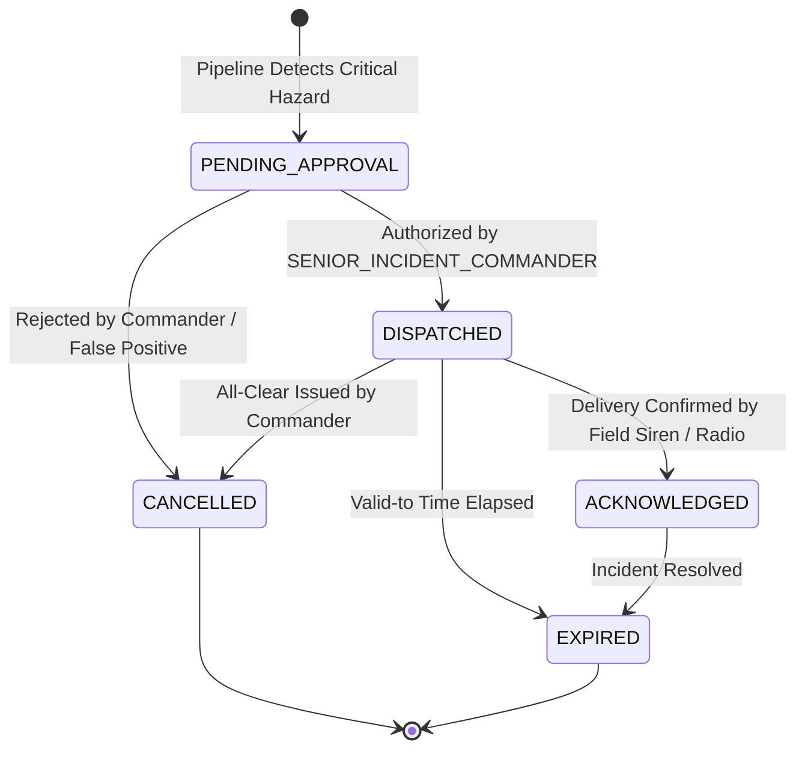

# FLOODY SHIELD v3.3 — Early Warning Alert Lifecycle & Life-Safety Protocol

**System**: FLOODY SHIELD  
**Target Basin**: Upper Beas River Basin — Kullu–Manali, Himachal Pradesh, India  
**Module**: `backend/app/services/alerts/lifecycle_service.py`  
**Standards**: ITU-T X.1303 / OASIS CAP v1.2 / NDMA Sachet Protocol  

---

## 1. Life-Safety Invariant: The Human Authorization Boundary

Disaster decision-support systems operating in high-consequence public safety domains must prevent automated false alarms and hallucinated siren dispatches.

> **CRITICAL INVARIANT**:  
> No AI model, deep neural network, hydrodynamic simulation, or automated cron job in FLOODY SHIELD can autonomously broadcast public warnings or trigger emergency sirens.

All alert recommendations generated by the decision pipeline enter an immutable holding state: `PENDING_APPROVAL`.



---

## 2. Cryptographic Authorization Workflow

1. **Draft Generation (`POST /api/v1/alerts/draft`)**:
   - The decision pipeline or an analyst submits a draft scenario.
   - An alert record is created with `status="PENDING_APPROVAL"`.
   - The alert identifier is assigned (e.g., `CAP-HPSDMA-20260921-C2DA8B`).
   - A real-time notification (`ALERT_DRAFT_CREATED`) is pushed to the Incident Commander's console via WebSocket.

2. **Commander Sign-Off (`POST /api/v1/alerts/{alert_id}/authorize`)**:
   - The Incident Commander reviews the evidence, model uncertainty bounds, and spatial exposure map.
   - The Commander submits an authorization request containing:
     - `actor_id` (Commander's identity)
     - `actor_role`: Must be strictly `SENIOR_INCIDENT_COMMANDER` or `ADMIN`.
     - Valid Bearer JWT signed with the system secret key.
   - **Verification**: If the role is `OBSERVER` or `ANALYST`, the request is **rejected with HTTP 403 Forbidden**.
   - Upon successful authorization:
     - Alert status transitions to `DISPATCHED`.
     - ITU-T X.1303 bilingual CAP v1.2 XML is serialized.
     - An append-only audit record is inserted with SHA-256 hash chaining.
     - A real-time event (`ALERT_DISPATCHED`) is broadcast over the public siren and broadcast network.

3. **Downstream Field Acknowledgement (`POST /api/v1/alerts/{alert_id}/acknowledge`)**:
   - Emergency Operations Center field units, mobile siren operators, and civil defense squads submit acknowledgement payloads:
     - `recipient_id` (e.g., `CIVIL_DEFENSE_AUT_SQUAD_4`)
     - `channel` (`SIREN`, `EOC_RADIO_CONDUIT`, `SMS_GATEWAY`, `MOBILE_APP`)
     - `notes` (e.g., "Siren sounded in Aut village, evacuation underway.")
   - Stored in `alert_acknowledgements` table with status `CONFIRMED`.

4. **Cancellation / All-Clear (`POST /api/v1/alerts/{alert_id}/cancel`)**:
   - When floodwaters recede or the threat abates, the Commander issues a cancellation.
   - An update CAP XML with `<msgType>Cancel</msgType>` is dispatched.

---

## 3. OASIS CAP v1.2 Bilingual XML Serialization

Serializes standard bilingual feeds (English + Hindi) conforming to NDMA Sachet specifications:

```xml
<?xml version="1.0" encoding="UTF-8"?>
<alert xmlns="urn:oasis:names:tc:emergency:cap:1.2">
  <identifier>CAP-HPSDMA-20260921-C2DA8B</identifier>
  <sender>FLOODY_SHIELD_EOC_KULLU</sender>
  <sent>2026-09-21T12:00:00+00:00</sent>
  <status>Actual</status>
  <msgType>Alert</msgType>
  <scope>Public</scope>
  <info>
    <language>en-IN</language>
    <category>Met</category>
    <event>Flash Flood &amp; Landslide</event>
    <urgency>Immediate</urgency>
    <severity>Extreme</severity>
    <certainty>Observed</certainty>
    <headline>FLASH FLOOD EMERGENCY — UPPER BEAS CORRIDOR</headline>
    <description>Torrential cloudburst induced surge along Beas River and tributaries.</description>
    <instruction>Evacuate riverbed ribbon immediately. Move to designated high-ground shelters.</instruction>
    <area>
      <areaDesc>Upper Beas River Basin (Manali-Kullu-Aut Corridor)</areaDesc>
    </area>
  </info>
  <info>
    <language>hi-IN</language>
    <category>Met</category>
    <event>आकस्मिक बाढ़ एवं भूस्खलन</event>
    <urgency>Immediate</urgency>
    <severity>Extreme</severity>
    <certainty>Observed</certainty>
    <headline>आकस्मिक बाढ़ आपातकाल — ऊपरी ब्यास गलियारा</headline>
    <description>अत्यधिक वर्षा के कारण ब्यास नदी में भारी जलस्तर वृद्धि।</description>
    <instruction>नदी के किनारे से तुरंत सुरक्षित ऊंचे स्थानों पर जाएं।</instruction>
  </info>
</alert>
```
