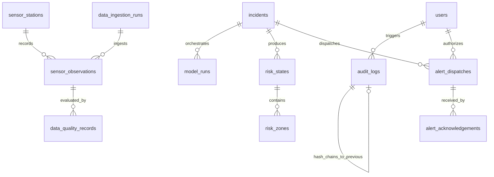

# FLOODY SHIELD v3.3 — Database Schema & Data Models Specification

**Database Engine**: PostgreSQL 15+ with PostGIS 3.3+ (GeoAlchemy2)  
**ORM**: SQLAlchemy 2.0  
**Migration Engine**: Alembic (Bi-Directional, Version: `6071286b9e46`)  

---

## 1. Schema Overview

The FLOODY SHIELD v3.3 persistence layer comprises 16 tables covering observations, quality gates, model runs, multi-hazard risk states, spatial layers, alert dispatches, acknowledgements, and tamper-evident audit logs.

---

## 2. Table Catalog & Column Definitions

### 2.1 Identity & Access Control
- **`users`**: System users with granular Role-Based Access Control (RBAC).
  - `id` (VARCHAR(64), PK): UUID
  - `username` (VARCHAR(64), UNIQUE, INDEX): Login username
  - `email` (VARCHAR(128), UNIQUE): Contact email
  - `hashed_password` (VARCHAR(256)): Bcrypt hashed password
  - `full_name` (VARCHAR(128)): Officer full name
  - `agency` (VARCHAR(128)): EOC, HPSDMA, NDMA, CWC, IMD
  - `badge_number` (VARCHAR(64)): Official agency authorization badge
  - `role` (VARCHAR(32)): `OBSERVER`, `ANALYST`, `SENIOR_INCIDENT_COMMANDER`, `ADMIN`
  - `is_active` (BOOLEAN): Account status

### 2.2 Telemetry & Data Ingestion
- **`sensor_stations`**: In-situ weather, hydrological, and geotechnical ground stations.
  - `id` (VARCHAR(64), PK): e.g., `STN_BHUNTAR_01`
  - `name`, `station_type`, `latitude`, `longitude`, `elevation_m`
  - `geom` (GEOMETRY(Point, 4326)): Spatial point representation
  - `status`, `last_seen`
- **`sensor_observations`**: Time-series sensor measurements.
  - `id` (VARCHAR(64), PK): UUID
  - `station_id` (VARCHAR(64), FK -> `sensor_stations.id`)
  - `data_source_id` (VARCHAR(64)): `IMD_AWS`, `CWC_RIVER`, `GPM_IMERG`, `SENTINEL_COPERNICUS`, `UPPER_BEAS_IOT`
  - `timestamp` (DATETIME, INDEX)
  - `observed_at` (DATETIME)
  - `rainfall_rate_mmh`, `cumulative_rainfall_mm`, `water_level_m`, `discharge_m3s`, `soil_moisture_pct`, `pore_water_pressure_kpa`
  - `quality_state` (VARCHAR(32)): `FRESH`, `STALE`, `EXPIRED`, `DEGRADED`, `CRITICAL_ERROR`
  - `idempotency_hash` (VARCHAR(64), UNIQUE, INDEX): SHA-256 payload deduplication hash
  - `provenance_category` (VARCHAR(32)): Fixed as `OBSERVED`
  - `raw_payload_json`, `provenance_json`
- **`data_ingestion_runs`**: Ingestion batches.
  - `id` (VARCHAR(64), PK)
  - `source_name`, `started_at`, `completed_at`, `status`, `records_received`, `records_ingested`, `records_rejected`
- **`data_quality_records`**: Audit records for every sensor validation check.
  - `id` (VARCHAR(64), PK), `observation_id`, `data_source_id`, `rule_name`, `status`, `reason`, `evaluated_at`

### 2.3 Incidents & Model Runs
- **`incidents`**: Disaster incident contexts.
  - `id` (VARCHAR(64), PK): e.g., `INC-2026-0921-001`
  - `incident_type`, `status` (`ACTIVE`, `CONTAINED`, `CLOSED`, `POST_EVENT_ANALYSIS`)
  - `started_at`, `closed_at`, `lead_agency`, `commander_on_duty`
- **`model_runs`**: Execution log of every scientific adapter run.
  - `id` (VARCHAR(64), PK), `incident_id` (FK -> `incidents.id`)
  - `model_id` (VARCHAR(32)): M1 through M20
  - `model_version` (VARCHAR(32)), `artifact_hash` (VARCHAR(64))
  - `evidence_status` (VARCHAR(64)): Formal scientific benchmark status
  - `execution_state` (VARCHAR(32)): `COMPLETED`, `DEGRADED`, `FAILED`
  - `provenance_category` (VARCHAR(32)): `PREDICTED` or `MODELLED`
  - `output_hash` (VARCHAR(64)): SHA-256 hash of result JSON
  - `inputs_json`, `outputs_json`

### 2.4 Multi-Hazard Risk State
- **`risk_states`**: Authoritative consolidated hazard assessments.
  - `id` (VARCHAR(64), PK), `incident_id` (FK -> `incidents.id`)
  - `overall_risk_level` (`LOW`, `MODERATE`, `HIGH`, `CRITICAL`)
  - `confidence_score` (FLOAT: 0.0 - 1.0)
  - `flood_risk_score`, `landslide_risk_score`, `cascade_risk_score`
  - `affected_population_estimate`, `threatened_infrastructure_count`
  - `provenance_json`
- **`risk_zones`**: Spatial hazard polygons.
  - `id` (VARCHAR(64), PK), `risk_state_id` (FK -> `risk_states.id`)
  - `zone_name`, `hazard_type`, `risk_level`, `peak_depth_m`, `time_to_impact_sec`
  - `polygon_geojson`, `geom` (GEOMETRY(Polygon, 4326))

### 2.5 Spatial Infrastructure & Safe Zones
- **`infrastructure_assets`**: Bridges, roads, power substations, hospitals.
  - `id`, `name`, `asset_type`, `criticality_score`, `elevation_m`, `geom`
- **`population_zones`**: Settlements and tourist density clusters.
  - `id`, `name`, `census_population`, `vulnerability_index`, `geom`
- **`safe_zones`**: Pre-identified and dynamically verified shelters.
  - `id`, `name`, `zone_type`, `capacity`, `elevation_m`, `slope_degrees`, `is_accessible`, `geom`

### 2.6 Early Warning Alerts & Life Safety
- **`alert_dispatches`**: CAP early warning alerts.
  - `id` (VARCHAR(64), PK), `incident_id`
  - `identifier` (VARCHAR(64), UNIQUE): OASIS CAP identifier
  - `status` (`PENDING_APPROVAL`, `DISPATCHED`, `CANCELLED`, `EXPIRED`)
  - `scope`, `severity`, `urgency`, `certainty`
  - `headline_en`, `headline_hi`, `instruction_en`, `instruction_hi`
  - `cap_xml` (TEXT): Full ITU-T X.1303 / NDMA Sachet XML payload
  - `authorized_by` (FK -> `users.id`): Mandatory Commander ID
  - `dispatched_at`, `resolved_at`
- **`alert_acknowledgements`**: Downstream delivery confirmations.
  - `id` (VARCHAR(64), PK), `alert_id` (FK -> `alert_dispatches.id`)
  - `recipient_id`, `channel` (`SIREN`, `SMS_GATEWAY`, `EOC_RADIO`, `MOBILE_APP`)
  - `status` (`CONFIRMED`, `PENDING`, `FAILED`), `acknowledged_at`

### 2.7 Tamper-Evident Audit Trail
- **`audit_logs`**: Cryptographically hash-chained append-only action log.
  - `id` (VARCHAR(64), PK)
  - `timestamp` (DATETIME, INDEX)
  - `action` (VARCHAR(64)): e.g. `ALERT_AUTHORIZED_AND_DISPATCHED`
  - `actor_id` (VARCHAR(128)), `actor_role` (VARCHAR(64))
  - `target_entity_type`, `target_entity_id`, `changes`
  - `previous_hash` (VARCHAR(64)): SHA-256 of previous audit record
  - `entry_hash` (VARCHAR(64)): SHA-256 of current record concatenated with `previous_hash`

---

## 3. Migration Verification

Alembic migration revision `6071286b9e46` (`v3_3_initial_schema`):
- Cleanly applies all 16 tables and PostGIS geometry indexes on `upgrade head`.
- Cleanly drops all tables and constraints on `downgrade base`.
