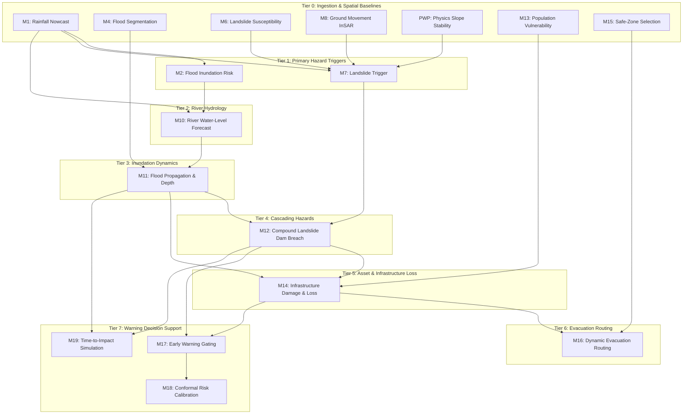

# FLOODY SHIELD v3.3 — Model Orchestration & Topological Execution Engine

**System**: FLOODY SHIELD  
**Target Basin**: Upper Beas River Basin — Kullu–Manali, Himachal Pradesh, India  
**Module**: `backend/app/orchestration/`  

---

## 1. Topological Hazard Dependency Graph (DAG)

The FLOODY SHIELD disaster hazard pipeline models the cascading physics of mountain disasters:
$$\text{Atmospheric Storm} \longrightarrow \text{Slope Saturation \& Landslides} \longrightarrow \text{River Runoff \& Surge} \longrightarrow \text{Landslide Damming \& Breaches} \longrightarrow \text{Downstream Impact \& Evacuation}$$

The orchestration engine executes models in topological dependency order across 8 concurrent execution tiers:

---

## 2. Dependency Taxonomy & Failure Isolation

Each edge in the graph is typed:
- **`HARD`**: Downstream node cannot execute without upstream output. If the upstream node fails, the downstream node fails immediately.
- **`SOFT`**: Downstream node can degrade gracefully using a conservative regional default or historical mean.
- **`OPTIONAL`**: Secondary enrichment; failure has zero impact on downstream viability.

### Failure Isolation Policy:
1. **No Artificial Zero Probabilities**: A failed model is recorded with state `FAILED` and error metadata. Its probability is **never** set to $0.0$ (which would falsely signal zero hazard to life-safety algorithms).
2. **Degraded Execution Propagation**: When a non-critical upstream dependency fails, downstream nodes run in `DEGRADED` state with wide conformal uncertainty bounds and clear operational warnings in the EOC dashboard.
3. **Database Provenance Tracking**: Every node execution generates a record in `model_runs` storing:
   - `model_version`
   - `artifact_hash` (verified against frozen sha256)
   - `evidence_status`
   - `started_at` and `completed_at`
   - `output_hash` (SHA-256 of JSON outputs)
   - Full input and output payloads

---

## 3. Scientific Evidence Statuses

The orchestration engine verifies that all models retain their audited evidence status:

| Model | Domain | Evidence Status | Provenance | Artifact Verified |
| :--- | :--- | :--- | :--- | :--- |
| **M1** | Rainfall Nowcasting | Research Prototype | PREDICTED | N/A (Rule/Heuristic) |
| **M2** | Flood Risk Classification | Preliminary External Evidence | PREDICTED | Verified (RF SHA-256) |
| **M4** | SAR Flood Segmentation | Proxy Validation (Sentinel-1) | PREDICTED | Verified (DeepLabV3+) |
| **M6** | Landslide Susceptibility | Insufficient Evidence | PREDICTED | Verified (RF SHA-256) |
| **M7** | Landslide Triggering | Preliminary External Evidence | PREDICTED | Verified (LGBM SHA-256) |
| **M8** | Ground Movement | Prototype / InSAR | PREDICTED | Heuristic |
| **PWP** | Physics Slope Stability | Hydrogeotechnical Physics | MODELLED | Infinite Slope Formula |
| **M10** | River Water-Level Forecast | Hydrological Machine Learning | PREDICTED | Heuristic / LSTM Proto |
| **M11** | Flood Propagation Depth | Hydrodynamic Physics | MODELLED | Manning Hydrodynamic |
| **M12** | Compound Hazard Cascade | Empirical Benchmark Evidence | MODELLED | Dam Breach Engine |
| **M13** | Population Vulnerability | Real Census / GIS | DERIVED | Census Vulnerability |
| **M14** | Infrastructure Damage/Loss | Exposure Matrix | DERIVED | Critical Asset Loss |
| **M15** | Safe-Zone Selection | Multi-Criteria GIS | DERIVED | Topo Refuge Scoring |
| **M16** | Evacuation Routing | Dijkstra / NetworkX | DERIVED | Hazard-Weighted Routing |
| **M17** | Early Warning Gating | Life-Safety Heuristic Gating | DERIVED | Decision Gate Matrix |
| **M18** | Risk Calibration | Synthetic Calibration Prototype | DERIVED | Conformal Predictor |
| **M19** | Time-to-Impact | Physics Proof-of-Concept | MODELLED | Hydrodynamic Wave Celerity |
| **M20** | Post-Event Damage | Satellite Change Detection | DERIVED | SAR Backscatter Differencing |
