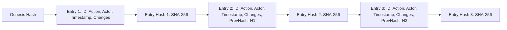

# FLOODY SHIELD v3.3 — Security, RBAC & Tamper-Evident Audit Trail

**System**: FLOODY SHIELD  
**Target Basin**: Upper Beas River Basin — Kullu–Manali, Himachal Pradesh, India  
**Modules**: `backend/app/core/security.py`, `backend/app/database/models/audit.py`, `backend/app/api/v1/endpoints/auth.py`  

---

## 1. Role-Based Access Control (RBAC) Architecture

Operational authority in FLOODY SHIELD is partitioned across 4 hierarchical security tiers:

| Role | Description | Allowed Actions | Restricted Actions |
| :--- | :--- | :--- | :--- |
| **`OBSERVER`** | Public observer, citizen, field volunteer | View public advisories, view GIS hazard maps, read-only dashboard | Cannot view draft alerts, cannot run models, cannot ingest data |
| **`ANALYST`** | Geospatial scientist, meteorologist, data engineer | Ingest telemetry, trigger model runs, simulate scenarios, generate alert drafts | Cannot authorize public alerts or dispatch sirens |
| **`SENIOR_INCIDENT_COMMANDER`** | Authorized SDMA / EOC District Magistrate / Incident Commander | Authorize and dispatch public alerts, cancel alerts, declare emergencies | System administrative configuration changes |
| **`ADMIN`** | System administrator | User management, key rotation, system maintenance, Commander actions | Direct tampering with historical audit logs |

---

## 2. Authentication & Credential Management

- **Password Hashing**: Native Openwall `bcrypt` with automatic salting and length-truncation protection.
- **Session Tokens**: Cryptographically signed JSON Web Tokens (`HS256`) containing user claims, role scope, and strict expiration times.
- **FastAPI Dependency Injection**:
  - `get_current_user(token, db)`: Validates JWT and retrieves active user.
  - `require_role(allowed_roles)`: Enforces role permissions per endpoint.

---

## 3. Cryptographic Tamper-Evident Audit Hash Chaining

To guarantee institutional accountability and non-repudiation during post-disaster judicial and government inquiries, all critical administrative actions are recorded in an append-only hash chain.

### Hash Computation Formula:
For any audit record $i$:
$$\text{Payload}_i = \text{SortJSON}\left(\{\text{id}, \text{timestamp}, \text{action}, \text{actor\_id}, \text{actor\_role}, \text{target\_entity\_type}, \text{target\_entity\_id}, \text{changes}, \text{previous\_hash}_{i-1}\}\right)$$
$$\text{EntryHash}_i = \text{SHA-256}\left(\text{Payload}_i\right)$$

### Verification Endpoint (`GET /api/v1/audit/verify-chain`):
Iterates through all audit records in chronological sequence and validates:
1. `entry_hash` equals `compute_hash(previous_hash)`.
2. Every record's `previous_hash` matches the preceding record's `entry_hash`.
3. Detects any backdated insertions, deletions, or column modifications.
