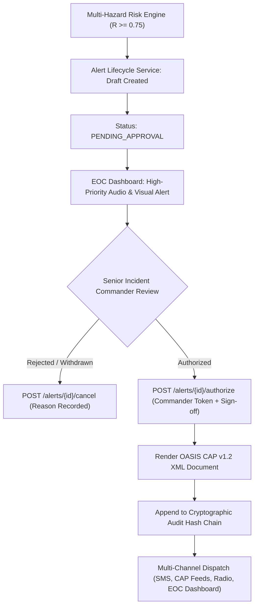

# FLOODY SHIELD v3.5 — Field Pilot Operational Runbook

**Target Basin:** Upper Beas River Basin (Kullu–Manali, Himachal Pradesh, India)  
**Version:** v3.5.0  
**Operational Scope:** Controlled Field Pilot Demonstration & Supervised Decision Support  
**Primary Agencies:** Himachal Pradesh State Disaster Management Authority (HPSDMA), DDMA Kullu, Central Water Commission (CWC), India Meteorological Department (IMD)  

---

## 1. Operating Principles & Safety Invariants

> [!IMPORTANT]
> **MANDATORY STATUTORY SAFETY INVARIANT**  
> FLOODY SHIELD is a decision-support system. The platform **NEVER** autonomously broadcasts public emergency alerts or activates physical sirens without verified human sign-off. All emergency alert releases MUST be explicitly authorized by a certified **SENIOR_INCIDENT_COMMANDER** over the secure REST interface.

1. **Human-in-the-Loop**: All AI-synthesized alerts remain in `PENDING_APPROVAL` status until reviewed and cryptographically signed.
2. **Provenance Honesty**: Displayed metrics must clearly state whether data is `OBSERVED` (ground gauge), `PREDICTED` (numerical model), `MODELLED` (physics simulation), or `SIMULATED` (test drill).
3. **Fail-Safe Operation**: If a field sensor or model goes offline, the system displays `DEGRADED` or `LOW_CONFIDENCE`. Operators must cross-verify with physical gauges.

---

## 2. Pilot Station Deployment Specifications

The field pilot covers five critical monitoring sites along the 85 km Upper Beas corridor:

```
[ST_MANALI_01] (2,050m) ---> [ST_KULLU_01] (1,220m) ---> [ST_BHUNTAR_01] (1,090m) ---> [ST_AUT_01] (960m) ---> [ST_LARJI_01] (950m)
 Catchment & Rain              Sarvari Confluence        Parbati Confluence           Gorge / NH-3 Slope      Dam Reservoir Inflow
```

### Station 1: ST_MANALI_01 (Solang Catchment Gauge)
- **Primary Function**: Upper precipitation intensity and early flood wave origin detection.
- **Sensors**: Optical Rain Gauge (TB4), Non-Contact Radar River Gauge (RL-15), FDR Soil Moisture Probe.
- **Power & Comms**: 12V LiFePO4 solar-backed battery; Cellular 4G with LoRaWAN mesh fallback.

### Station 2: ST_KULLU_01 (Kullu Town & Sarvari Confluence)
- **Primary Function**: River discharge and urban floodplain overtopping watch.
- **Sensors**: Acoustic Doppler Velocity Meter (ADVM), Dual-Chamber Rain Gauge, Submerged Pressure Transducer.
- **Power & Comms**: Grid-tied with 100Ah UPS; Primary Ethernet / Cellular 4G.

### Station 3: ST_BHUNTAR_01 (Bhuntar Airport & Parbati Confluence)
- **Primary Function**: Confluence backwater monitoring and airport runway protection.
- **Sensors**: Radar Water Level Gauge, Rating Curve Discharge Computer, Tipping Bucket Rain Gauge.
- **Power & Comms**: Solar hybrid power; Dual SIM Cellular 4G.

### Station 4: ST_AUT_01 (Aut Gorge & NH-3 Highway Corridor)
- **Primary Function**: Slope stability, landslide debris flow, and rockfall risk along NH-3.
- **Sensors**: Vibrating Wire Piezometers (PWP), Biaxial MEMS Inclinometers (Tilt), Radar Stage Gauge.
- **Power & Comms**: Solar 24V; LoRaWAN with Satellite Iridium emergency fallback.

### Station 5: ST_LARJI_01 (Larji Hydropower Dam Reservoir)
- **Primary Function**: Dam reservoir surcharge monitoring and compound cascade breach risk.
- **Sensors**: Reservoir Stilling Well Encoder, Hydro Inflow Computer, Precision Weighing Rain Gauge.
- **Power & Comms**: Dam Control Room dual UPS; Fiber-optic LAN with Cellular backup.

---

## 3. Daily Standard Operating Procedures (SOP)

### Shift Start Checklist (EOC Operators)
1. **System Health Verification**:
   - Access `GET /api/v1/system/status`. Confirm `database`, `model_registry`, and `ingestion` are `HEALTHY`.
   - Access `GET /api/v1/system/data-sources`. Verify IMD radar, CWC gauges, and IoT ground stations.
2. **Audit Trail Verification**:
   - Access `GET /api/v1/audit/verify-chain`. Confirm `chain_intact == True`.
3. **Station Heartbeat Review**:
   - Check `GET /api/v1/devices`. Ensure all 5 pilot devices show `last_seen_at < 5 minutes ago`.

### Telemetry Monitoring & Quality Gating
- Telemetry arriving with quality code `DEGRADED` or `ANOMALOUS` must be cross-checked against adjacent rainfall stations.
- If a sensor drops offline, notify the field maintenance team in Kullu or Manali.

---

## 4. Emergency Alert Authorization Workflow (Commander Sign-Off)

When the multi-hazard risk engine detects critical thresholds ($R \ge 0.75$):



### Authorization Command:
```http
POST /api/v1/alerts/{alert_id}/authorize
Authorization: Bearer <COMMANDER_JWT_TOKEN>
Content-Type: application/json

{
  "actor_id": "COMM_KULLU_01",
  "actor_role": "SENIOR_INCIDENT_COMMANDER",
  "approval_token": "HPSDMA_OFFICIAL_AUTHORIZATION_2026"
}
```

---

## 5. Field Troubleshooting & Maintenance

| Symptom | Probable Cause | Corrective Action |
|---|---|---|
| **Station shows `OFFLINE`** | Battery depletion or cellular outage | Check solar panel clearing; inspect SIM card; verify LoRaWAN gateway. |
| **Pore Water Pressure Spikes to Max** | Sensor lightning damage or cable pinch | Disconnect sensor, test with handheld multimeter; verify zero offset. |
| **Radar Stage Fluctuating Rapidly** | Debris buildup / standing waves | Inspect radar horn for silt splatter; adjust averaging filter window. |
| **Audit Verification Returns `INTEGRITY_VIOLATION`** | Unauthorized direct database alteration | Freeze database immediately; dump transaction logs; notify cyber security lead. |
