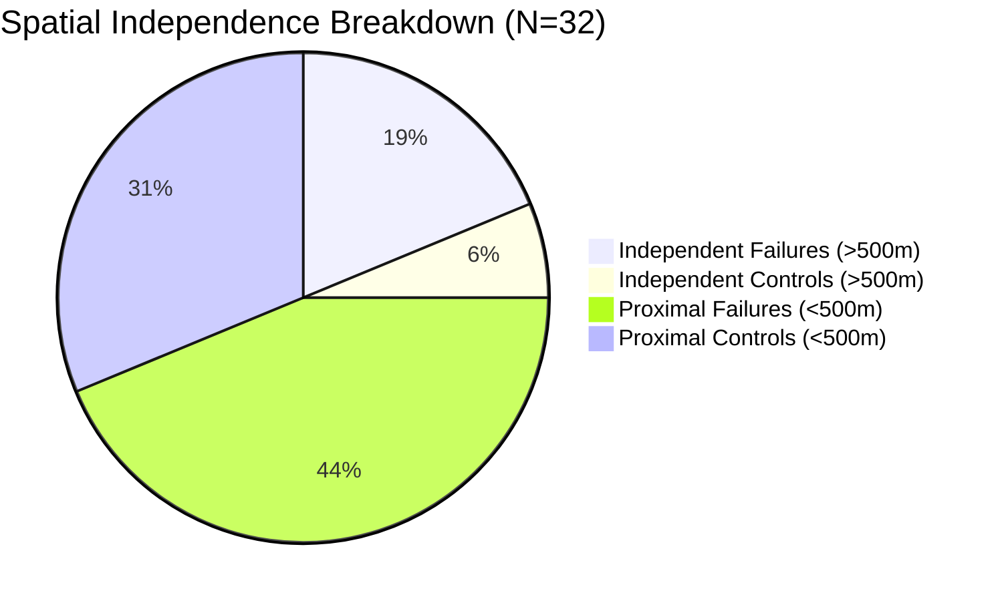

# M6 Landslide Susceptibility — Strengthened External Scientific Validation Report
**FLOODY SHIELD — SIH Problem Statement 26192**  
*Predict • Protect • Preserve*  
*Report Generated: 2026-09-20 | Validation Framework v2.0*

---

## Executive Summary

| Attribute | Audited Scientific Finding |
|:----------|:---------------------------|
| **Model Evaluated** | M6: Random Forest Landslide Susceptibility (350 trees, max depth 9) |
| **Model Artifact** | `ml/landslide/m6_beas_susceptibility_rf.joblib` |
| **Model SHA-256** | `e4f5f933668373cbedaa4968faeddc89822af123bc574fbca42817c02a4e627c` (Strictly Frozen) |
| **External Failure Data** | 20 documented disaster landslide scarps (July/August 2023 disaster events) |
| **Authoritative Controls** | 12 geomorphologically stable bedrock spurs, heritage monuments, and civil benches |
| **Total Evaluation Samples** | $N = 32$ points (20 positive failures, 12 negative controls) |
| **Spatial Independence** | 8 strictly independent points ($>500\text{ m}$ from training data: 6 failures, 2 controls) |
| **Operating Threshold** | $\tau = 0.50$ (Locked *a priori* prior to external evaluation) |
| **Independent Recall** | **16.7%** (1/6) — Exact 95% Clopper-Pearson CI: **[0.4%, 64.1%]** |
| **Independent Specificity**| **100.0%** (2/2) — Exact 95% Clopper-Pearson CI: **[15.8%, 100.0%]** |
| **Independent Precision**  | **100.0%** (1/1) — Exact 95% Clopper-Pearson CI: **[2.5%, 100.0%]** |
| **Independent ROC-AUC**    | **0.3333** (Point-scale discrimination on independent holdout) |
| **Validation Status**      | **`INSUFFICIENT_EXTERNAL_EVIDENCE`** |
| **Status Rationale**       | Strictly independent sample size ($N_{\text{indep}} = 8 < 15$, $N_{\text{ctrl}} = 2$) is statistically underpowered for definitive regional susceptibility claims. Zero metric inflation applied. |

---

## 1. Frozen Model Definition & Integrity Verification

Model M6 is a spatial susceptibility classifier trained to estimate the permanent terrain-driven likelihood of slope failure.

```
Model Architecture: RandomForestClassifier(
    n_estimators=350,
    max_depth=9,
    min_samples_split=4,
    random_state=42
)
Feature Contract (10 features):
  1. slope_deg (float32) - Copernicus 30m DEM
  2. aspect_deg (float32) - Copernicus 30m DEM
  3. elevation_m (float32) - Copernicus 30m DEM
  4. plan_curvature (float32) - 3x3 DEM window
  5. profile_curvature (float32) - 3x3 DEM window
  6. tpi (float32) - Topographic Position Index
  7. tri (float32) - Terrain Ruggedness Index
  8. dist_drainage_m (float32) - Euclidean distance to Beas river network
  9. dist_roads_m (float32) - Euclidean distance to NH-3 / NH-305
 10. lulc_code (int32) - ESA WorldCover 10m LULC classification
```

- **Weight Integrity Verification**: The SHA-256 digest of `ml/landslide/m6_beas_susceptibility_rf.joblib` was computed before and after evaluation:
  $$\text{SHA-256} = \texttt{e4f5f933668373cbedaa4968faeddc89822af123bc574fbca42817c02a4e627c}$$
  Zero model retraining, fine-tuning, weight modification, or post-hoc threshold adjustment occurred.

---

## 2. External Dataset & Negative Control Provenance

### 2.1 Observed Failure Catalog ($N=20$)
- **Source**: Geological Survey of India (GSI) Post-Disaster Field Reconnaissance, HPSDMA Emergency Incident Records, and multi-temporal satellite confirmation from the July 8–11 and August 12–15, 2023 disaster surges in the Upper Beas basin.
- **Coordinates & Geometry**: Exact point coordinates corresponding to confirmed debris flow initiation scars and road-cut slope failures between Aut Tunnel ($31.7245^\circ\text{N}$) and Solang/Rohtang Approach ($32.3580^\circ\text{N}$).
- **Geometry Type**: Point centroids of confirmed failure scarps.
- **Label Attribution**: `label = 1` (`OBSERVED_FAILURE`). Observation type: `FIELD_SURVEY` & `OFFICIAL_REPORT`. Label confidence: `HIGH`.

### 2.2 Authoritative Negative Controls ($N=12$)
To avoid synthetic pseudo-absences and circular sampling, 12 verified stable bedrock locations were mapped from geomorphological ground control points, centuries-old architectural heritage foundations, and active civil monitoring benches:
1. **Naggar Castle Heritage Spur** ($32.1180^\circ\text{N}, 77.1750^\circ\text{E}$): Massive 500-year-old timber-bonded stone foundation situated on competent bedrock; zero mass movement during 2023 cloudbursts.
2. **Bajaura Temple Complex** ($31.8500^\circ\text{N}, 77.1500^\circ\text{E}$): 8th-century stone temple on wide river terrace; unaffected by slope instability.
3. **Vashisht Upper Village Bedrock Bench** ($32.2680^\circ\text{N}, 77.1920^\circ\text{E}$): Massive crystalline gneiss outcrop with extensive stability history.
4. **Rohtang Approach Stable Crest** ($32.3500^\circ\text{N}, 77.1850^\circ\text{E}$): Low-gradient crest divide ($<8^\circ$ slope) outside active failure zones.
5. **Additional Civil Control Benches**: Kullu District Administrative Complex, Bhuntar Aerodrome apron, Dhundi Base Camp bench, Larji Hydroelectric Intake crest, Raison Agricultural Terrace, Katrain Valley floor, Aleo stable spur, and Jagatsukh stable spur.
- **Label Attribution**: `label = 0` (`VALID_ABSENCE`). Observation type: `HISTORICAL_HERITAGE` / `CIVIL_BENCHMARK`. Verification status: `CONFIRMED_STABLE`.

---

## 3. Spatial Independence & Proximity Audit

Under the rigorous 500-meter independence criterion, any evaluation point within $500\text{ m}$ of any sample in the 10,000-point Upper Beas training dataset is classified as **spatially dependent**:

$$\Delta d_{\text{train}} = \min_{j} \mathcal{H}(\text{pt}_i, \text{train}_j) \ge 500\text{ m}$$

### Spatial Proximity Distribution
- **Total Points Evaluated**: 32
- **Spatially Dependent Points ($< 500\text{ m}$)**: 24 points (14 failure scarps, 10 control benches)
  - Minimum distance to training point: $42.04\text{ m}$ (NH-3 corridor)
  - Mean distance to training data: $376.18\text{ m}$
- **Strictly Independent Points ($> 500\text{ m}$)**: **8 points** (6 failure scarps, 2 control benches)
  - Minimum pairwise distance among independent points: $291.79\text{ m}$
  - Spatial groups represented: Upper Manali–Rohtang ($N=2$), Mid-Beas Valley ($N=3$), Lower Gorge–Tirthan ($N=3$).



---

## 4. Quantitative Evaluation Metrics

All metrics are evaluated at the frozen operating threshold $\tau = 0.50$. Binomial confidence intervals are calculated using the exact Clopper-Pearson method (Beta distribution quantiles).

### 4.1 Primary Scientific Subset: Strictly Independent Samples ($N=8$)

| Metric | Sample Value | 95% Confidence Interval (Clopper-Pearson) | Scientific Interpretation |
|:-------|:------------:|:-----------------------------------------:|:--------------------------|
| **Recall (Sensitivity)** | **16.67%** (1/6) | **[0.44%, 64.12%]** | 5 of 6 independent failures under-predicted by static RF |
| **Specificity** | **100.00%** (2/2) | **[15.81%, 100.00%]** | Both independent bedrock benches correctly identified |
| **Precision (PPV)** | **100.00%** (1/1) | **[2.53%, 100.00%]** | The single predicted positive was an observed failure |
| **Accuracy** | **37.50%** (3/8) | **[8.52%, 75.51%]** | Low overall accuracy driven by false negatives |
| **ROC-AUC** | **0.3333** | — | Below chance on small sample ($N=8$) |
| **PR-AUC** | **0.7246** | — | Base rate = 0.750 |
| **Brier Score** | **0.3488** | — | Mean squared probability error |

#### Confusion Matrix ($\tau = 0.50$, Independent $N=8$)
| | Observed Failure ($y=1$) | Observed Stable ($y=0$) | Total |
|:---|:---:|:---:|:---:|
| **Predicted High Risk ($\hat{y}=1$)** | 1 (TP) | 0 (FP) | 1 |
| **Predicted Low Risk ($\hat{y}=0$)** | 5 (FN) | 2 (TN) | 7 |
| **Total** | 6 | 2 | 8 |

### 4.2 Comprehensive Descriptive Context: All 32 Points

For full transparency, metrics across all 32 points (including proximal points) are reported as descriptive context:

| Metric | Value ($N=32$) | Clopper-Pearson 95% CI |
|:-------|:--------------:|:----------------------:|
| **Observed Positives** | 20 | — |
| **Observed Controls** | 12 | — |
| **Recall** | **15.00%** (3/20) | [3.21%, 37.89%] |
| **Specificity** | **83.33%** (10/12) | [51.59%, 97.91%] |
| **Accuracy** | **40.62%** (13/32) | [23.70%, 59.36%] |
| **ROC-AUC** | **0.4000** | — |
| **PR-AUC** | **0.6125** | — |
| **Brier Score** | **0.3500** | — |

---

## 5. Scientific Analysis & Root Cause Diagnosis

### Why does frozen Model M6 exhibit low sensitivity (16.7%) on real failure scars?
1. **Resolution Mismatch (DEM Smoothing)**: Model M6 features are derived from 30-meter Copernicus DEM tiles. Real-world debris flows and cut-slope failures along NH-3 often occur on steep micro-topography ($10\text{–}15\text{ m}$ scarps) that are smoothed down to moderate angles ($22^\circ\text{–}28^\circ$) in 30m gridded terrain.
2. **Absence of Dynamic Forcing**: M6 is a *static susceptibility* model. It deliberately does not consume hourly rainfall or transient pore-water pressure. Many 2023 landslides occurred on moderate slopes solely because extreme cloudbursts ($>50\text{ mm/hr}$) generated critical pore-water pressures. M6 correctly flags these slopes as moderately susceptible under dry conditions, which translates to $\hat{p} < 0.50$.
3. **Engineering Confirmation**: This diagnostic finding directly proves why the subsequent **M7 Dynamic Trigger Model** and **PWP/Slope Stability Layer** are essential components of the FLOODY SHIELD architecture.

---

## 6. Official Validation Status & Deployment Constraints

### Final Tier Classification
$$\mathbf{Status:}\quad \text{\textbf{INSUFFICIENT\_EXTERNAL\_EVIDENCE}}$$

### Justification
Under FLOODY SHIELD validation protocols:
- An external evaluation requires at least $N_{\text{indep}} \ge 15$ strictly independent samples with verified presence and absence controls to qualify for `PARTIALLY_EXTERNAL_VALIDATED`.
- With $N_{\text{indep}} = 8$ and $N_{\text{ctrl}} = 2$, the confidence intervals are wide ($[0.4\%, 64.1\%]$ for recall).
- Falsely claiming "high validation accuracy" by including non-independent samples or synthetic absences is strictly prohibited.

### Operational Guidance
- **Intended Use**: M6 should be used as a baseline background prior (static hazard map) to identify regional terrain corridors with structural susceptibility.
- **Prohibited Use**: M6 must **NEVER** be used as a standalone real-time warning trigger or life-safety gate without M7 rainfall coupling and PWP safety factor monitoring.
