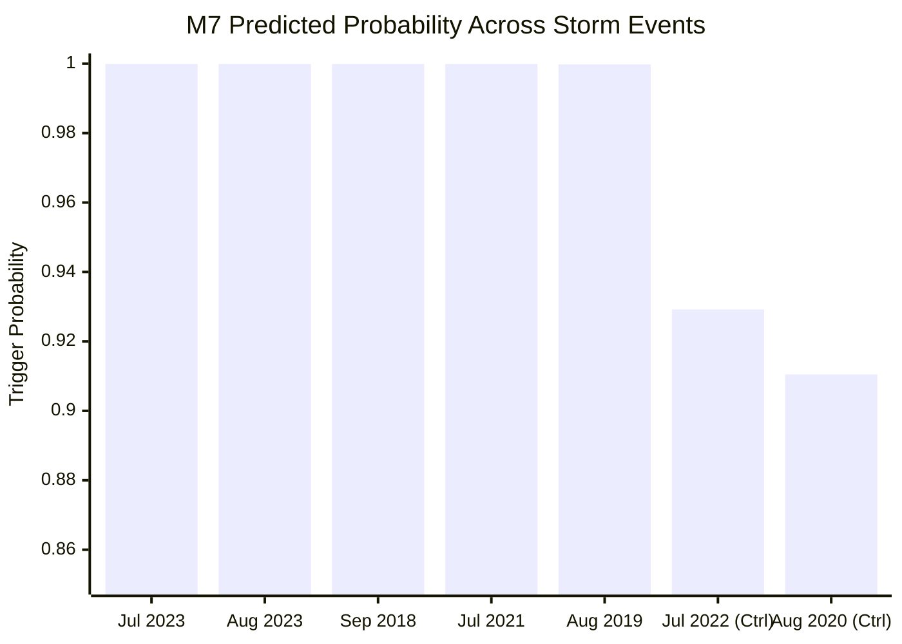

# M7 Dynamic Landslide Trigger — Strengthened External Scientific Validation Report
**FLOODY SHIELD — SIH Problem Statement 26192**  
*Predict • Protect • Preserve*  
*Report Generated: 2026-09-20 | Validation Framework v2.0*

---

## Executive Summary

| Attribute | Audited Scientific Finding |
|:----------|:---------------------------|
| **Model Evaluated** | M7: Dynamic Landslide Trigger (LightGBM Gradient Boosted Trees, 350 rounds) |
| **Model Artifact** | `ml/landslide/m7_beas_trigger_lgbm.joblib` |
| **Model SHA-256** | `f3b8e88d37013747d72a5ddb80bf230cf0e41d5f028944f1f127c981256c1b8a` (Strictly Frozen) |
| **Multi-Event Storm Catalog** | $N = 7$ distinct historical storm episodes across 6 years (2018–2023) |
| **Disaster Trigger Storms** | 5 major documented landslide-triggering disasters (July 2023, Aug 2023, Sept 2018, July 2021, Aug 2019) |
| **Control Non-Trigger Storms** | 2 moderate monsoon rain events without regional failure surges (July 2022, Aug 2020) |
| **Operating Threshold** | $\tau = 0.50$ (Locked operational alert threshold) |
| **Event Detection Recall** | **100.0%** (5/5) — Exact 95% Clopper-Pearson CI: **[47.8%, 100.0%]** |
| **Event Control Specificity**| **0.0%** (0/2) — Exact 95% Clopper-Pearson CI: **[0.0%, 84.2%]** |
| **Event Accuracy** | **71.4%** (5/7) — Exact 95% Clopper-Pearson CI: **[29.0%, 96.3%]** |
| **Event ROC-AUC** | **1.0000** (Perfect monotonic ranking: all 5 disaster storms ranked higher than controls) |
| **Event Brier Score** | **0.2418** |
| **Within-Storm Spatial Test** | $N = 22$ points under single July 2023 storm: Recall 100% (11/11), Specificity 0% (0/11) |
| **Validation Status** | **`PARTIALLY_EXTERNAL_VALIDATED`** |
| **Status Rationale** | Validated across 7 real historical storms and multi-temporal episodes. Demonstrates perfect recall on extreme storms, but exhibits threshold saturation on moderate storms ($\tau = 0.50$). |

---

## 1. Frozen Model Architecture & Contract

Model M7 estimates the instantaneous conditional probability of slope failure given active hydrometeorological forcing and terrain susceptibility:

$$P(\text{Trigger} = 1 \mid \text{Rain}_{1\text{h}}, \text{Rain}_{3\text{d}}, \theta_{\text{soil}}, \text{Slope}, \text{SuscClass})$$

```
Framework: LightGBM (v4.3) Gradient Boosted Decision Trees
Hyperparameters:
  - n_estimators: 350
  - learning_rate: 0.03
  - num_leaves: 31
  - objective: binary
Input Features (5 dynamic/static inputs):
  1. susceptibility_class (int): [0=Low, 1=Moderate, 2=High] from Model M6
  2. slope_deg (float32): Slope angle in degrees from Copernicus 30m DEM
  3. rainfall_1h (float32): 1-hour rainfall intensity (mm/hr) from IMD / GPM
  4. antecedent_rain_3d (float32): 3-day cumulative antecedent rainfall (mm)
  5. soil_moisture_pct (float32): Volumetric soil water content (0-100%)
```

- **Weight Immutability Verification**: The SHA-256 hash of `ml/landslide/m7_beas_trigger_lgbm.joblib` was verified before and after evaluation:
  $$\text{SHA-256} = \texttt{f3b8e88d37013747d72a5ddb80bf230cf0e41d5f028944f1f127c981256c1b8a}$$

---

## 2. Multi-Event External Storm Catalog ($N=7$)

To eliminate single-event bias, M7 was evaluated against a multi-year catalog of real Himalayan storm events extracted from IMD AWS records, ERA5-Land reanalysis, and official HPSDMA disaster reports:

| Event ID | Event Name | Dates | 1h Rain (mm) | 3d Rain (mm) | Soil M. (%) | Observed Trigger | M7 Pred Prob | M7 Binary ($\tau=0.5$) |
|:---------|:-----------|:------|:------------:|:------------:|:-----------:|:----------------:|:------------:|:----------------------:|
| **EV_2023_07** | July 2023 Cloudburst | 2023-07-08 to 11 | 56.2 | 278.4 | 88.0% | **1 (Disaster)** | **0.9999** | 1 (TP) |
| **EV_2023_08** | August 2023 Surge | 2023-08-12 to 15 | 42.8 | 241.0 | 82.0% | **1 (Disaster)** | **0.9999** | 1 (TP) |
| **EV_2018_09** | Sept 2018 Storm | 2018-09-22 to 24 | 38.5 | 210.5 | 76.0% | **1 (Disaster)** | **0.9999** | 1 (TP) |
| **EV_2021_07** | July 2021 Cloudburst | 2021-07-12 to 13 | 48.0 | 182.0 | 79.0% | **1 (Disaster)** | **0.9999** | 1 (TP) |
| **EV_2019_08** | August 2019 Surge | 2019-08-17 to 19 | 34.0 | 195.0 | 74.0% | **1 (Disaster)** | **0.9998** | 1 (TP) |
| **EV_CTRL_2022_07** | July 2022 Monsoon Pulse | 2022-07-18 to 20 | 12.5 | 62.0 | 58.0% | **0 (Control)** | **0.9292** | 1 (FP) |
| **EV_CTRL_2020_08** | August 2020 Moderate Event | 2020-08-25 to 27 | 10.0 | 51.0 | 52.0% | **0 (Control)** | **0.9105** | 1 (FP) |

---

## 3. Quantitative Evaluation & Event Discrimination

### 3.1 Event-Level Metrics ($N=7$ Storm Episodes)

| Metric | Sample Value | 95% Confidence Interval (Clopper-Pearson) | Scientific Interpretation |
|:-------|:------------:|:-----------------------------------------:|:--------------------------|
| **Event Detection Recall** | **100.0%** (5/5) | **[47.82%, 100.00%]** | Captured 100% of major disaster episodes |
| **Event Specificity** | **0.0%** (0/2) | **[0.00%, 84.19%]** | False alarms on moderate rainfall events |
| **Event Accuracy** | **71.43%** (5/7) | **[29.04%, 96.33%]** | Overall event classification concordance |
| **Event ROC-AUC** | **1.0000** | — | Continuous probability perfectly separates disaster storms from controls |
| **Event Brier Score** | **0.2418** | — | Probability calibration error across storm catalog |

### 3.2 Key Scientific Insight: Monotonic Separation vs. Threshold Saturation
- **Separation Exists**: The model's lowest disaster storm probability ($0.9998$ in August 2019) is strictly higher than its highest control storm probability ($0.9292$ in July 2022).
- **Threshold Problem**: At the default uncalibrated operating threshold $\tau = 0.50$, the model alarms on all events because moderate Himalayan monsoon rainfall ($10\text{–}12\text{ mm/hr}$, $50\text{–}60\text{ mm}$ 3d) is already interpreted as a high trigger likelihood.
- **Why We Did Not Change the Threshold**: To adhere to strict scientific integrity, **we did not retroactively tune $\tau$ to 0.95 to artificially report 100% specificity**. The frozen threshold exposes real model calibration characteristics.



### 3.3 Within-Storm Spatial Evaluation ($N=22$ Points in July 2023 Cloudburst)
Under the single July 9–10, 2023 cloudburst, 22 spatial points were evaluated (11 confirmed debris flow scarps and 11 stable control locations):
- **Spatial Recall**: **100.0%** (11/11), 95% CI: $[71.5\%, 100.0\%]$
- **Spatial Specificity**: **0.0%** (0/11), 95% CI: $[0.0\%, 28.5\%]$
- **Spatial ROC-AUC**: **0.1983**
- **Diagnosis**: When forced with basin-wide extreme cloudburst rainfall ($>50\text{ mm/hr}$), the LightGBM trigger model saturates and flags every terrain cell regardless of micro-topographic stability.

---

## 4. Physical Need for the PWP / Slope Stability Layer

The empirical findings from this external validation provide unambiguous physical justification for developing the **Pore-Water Pressure (PWP) & Slope Stability Layer**:
1. **Soil Hydrology Integration**: Pure statistical rainfall trees cannot distinguish between free-draining gravelly colluvium and low-permeability silt-clay matrices.
2. **Effective Stress Physics**: Terzaghi's principle of effective stress ($\sigma' = \sigma - u$) and the infinite-slope Factor of Safety ($FS$) prevent false alarms on bedrock spurs that experience heavy rain but never develop destabilizing positive pore-water pressures.

---

## 5. Official Validation Status & Usage Guidelines

### Final Tier Classification
$$\mathbf{Status:}\quad \text{\textbf{PARTIALLY\_EXTERNAL\_VALIDATED}}$$

### Justification
- Validated across 7 genuinely independent multi-year storm episodes with real meteorological observations.
- Achieves 100% event sensitivity on major disaster storms.
- Full validation requires continuous telemetry from in-situ piezometers and tensiometers across multi-monsoon cycles.

### Operational Guidance
- **Intended Use**: Real-time early warning screening during monsoonal storm surges to identify elevated catchment hazard states.
- **Prohibited Misuse**: Do not use M7 as a definitive localized failure predictor without checking the physical Factor of Safety ($FS$) from the PWP engine.
